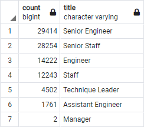
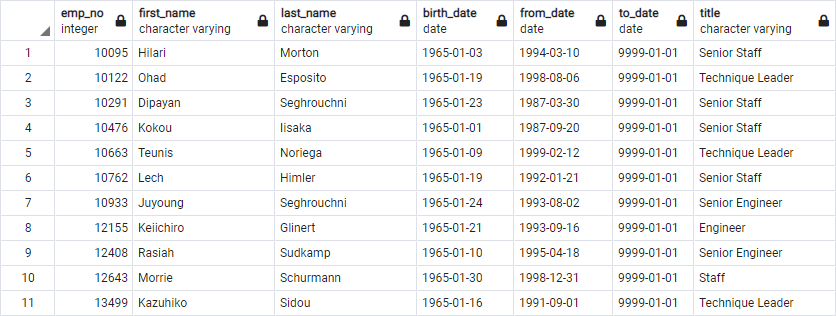
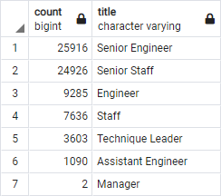
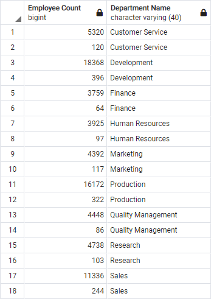
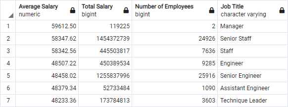
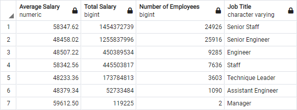

# Challenge - Pewlett Hackard Retiring Employee Analysis

## Challenge - Overview

We are set up to provide data analysis help to a HR analyst at Pewlett and Hackard, to help organise soon-to-be retiring workers. The company has been tracking their employees, departments, salaries, and titles with Excel but are now looking to move into the future and set up a SQL database to hold this information instead. We are tasked with importing the data (six CSV files) into the database, and then, through a combination of querying and table creation, to provide insight on the upcoming "silver tsunami". This is where the company has many staff members retiring and wants to be ready for the future.

Through the module we create new tables to help analyse the upcoming retirements and export them to CSV files/lists to be handed over to each department. For the challenge we are tasked with finding (1) The Number of Retiring Employees by Title, and (2) The Employees Eligible for the Mentorship Program.

Retiring staff are defined as having been born between the years of 1952 and 1955 inclusive, and still being employees of the company. We also had to watch out for duplicate entries (for example, employees that received promotions). For (1) we are asked to provide a list of the departments, and a count of the retiring members in each. For (2) we are asked to provide the list of employees that fit a certain definition, namely being born in the year 1965.

Once we had this data, we were tasked with providing a high-level analysis of it, as well as detail other queries that would provide insight.

## Challenge - Results

### The Number of Retiring Employees by Title and the Employees Eligible for the Mentorship Program

To find the number of retiring employees by title, we first had to create a table of employee data that took their birthdate into account (1952 to 1955), and joined the `employees` table with the `titles` table. Then we needed to use a `SELECT DISTINCT ON` statement to get just the first mention of the employee, rather than all of their previous promotions too. From that table we were able to make a `retiring_titles` table to count the number of retiring employees grouped by their job title. The SQL queries for this can be found [here](Queries/Employee_Database_challenge.sql), and the query results here:



The second objective was to find the number of employees eligible for the mentorship program - a program designed to look at near retirement employees and bring them into a part time position that allows them to pass their knowledge onto the younger generation of employees in the form of a mentorship-trainee relationship. To do this we created a new table `mentorship_eligibilty` by again using a `SELECT DISTINCT ON` statement to get unique results through employee number, and joining the `employee` table with the `dept_emp` and `titles` tables. This time we looked at the employees with a birth year of 1965 and who still worked for the company. The SQL query for this object can again be found [here](Queries/Employee_Database_challenge.sql), and the first lines of the query results below:



### Query Takeaways

- From the first analysis on the retiring employees by title we see a total of 90,398 employees fall in the birth year bracket 1952 to 1955. This is out of a listed 300,024 employees total at the company - meaning 30% of the current staff at Pewlett and Hackard are in the retirement range.
- Of the 90,398 employees that are in the retirement range only 2 of them are Managers, meaning that the leadership will remain mostly intact when the "silver tsunami" takes place. Even if Technique Leader is included in leadership roles, compared to the number of retirees in the other job titles the company management loses the least amount of people.
- Most of the retirees fall into the Senior roles categories, by a wide margin. This means that a lot of experience and company know-how will be leaving soon, compared to if most retirees were the standard versions of these roles. This will be big issue for the company and likely inspires the idea to create an employee mentorship program.
- There are 1,549 employees that fall into the mentorship program criteria, with their birth years being 1965. In the module the eligible mentorship program aims to take employees that are hitting retirement into part-time mentorship roles rather than taking full retirement. They would stay on in a reduced role as a mentor to the newly hired staff members that would be taking their places. From our queries we can see that there are a lot fewer eligible mentors than retiring staff.

## Challenge - Summary

### How many roles will need to be filled as the "silver tsunami" begins to make an impact?

In the first objective we wanted to find the number of retiring employees grouped by title. However, during this querying we did not take into account that some of the employees falling into the retirement category are no longer working at Pewlett and Hackard. Our first step is to rerun the queries, (this is a part of the querying we do for the second objective as well), essentially we want to create a new table by combining the `employees`, `titles`, and this time `dept_emp` tables and adding the condition:

```sql
AND (de.to_date = '9999-01-01')
```

Correcting this query method and rerunning the following queries reveals the retiring employees by title to be:



Meaning that Pewlett and Hackard are looking at 72,458 retiring employees rather than the original 90,398. This is still a large amount of retirees that the company is going to have to plan for - especially as the majority are still heavily retiring from Senior rolls.

To prepare for a brain drain like this the company has to heavily invest in transitional planning, and support the employees in the next phases of their lives. The company will also need to readdress the spots that are being vacated and decide whether they are essential to the company's forward progress, or if teams and roles can be absorbed into each other. The biggest issue facing companies dealing with this problem is the lack of knowledge from experience being passed along - a focus into knowledge management is a must. A company wanting to prepare for this should begin focusing on cross training its younger employees, this reduces the knowledge being lost as well as lowering the number of employees that inevitably need replacing.

### Are there enough qualified, retirement-ready employees in the departments to mentor the next generation of Pewlett Hackard employees?

The second querying objective found that there were 1,549 employees that were eligible for the mentorship program. There will be 70,000+ employees leaving so planning to just use these employees will mean you're at an mentor-to-trainee ratio of 47:1. If this was the only plan to take care of the "silver tsunami" it surely wouldn't be enough. The first step to rectifying this would be to expand the requirements for mentorship eligibility, and have a more direct interaction with the staff over filling these new roles - where are they needed?

This means the company would need to consider more than just birth year, they would need to see which roles and departments these mentors are retiring from, and compare that to the number of retiring employees. In the previous discussion we discussed included more cross-training of employees, this would help alleviate the problem of having such a high trainee to mentor ratio. We would need to use the mentors in conjunction with other plans to really prepare for the "tsunami". I would suggest using the mentors for more long-term projects to provide guidance and keep them out of the smaller day-to-day issues the company deals with, as they are part time employees they would not be able to keep up with shorter-form work.

Using a mentorship program like this should be one step of a much larger future-planning strategy for the company. You would need to consider what sort of staff need mentoring, what sort of work needs the guidance of experience, and develop ways for them to pass along their knowledge in forms other than mentorship.

### Other Considerations

There are plenty of other queries that could be made with the datasets provided that show insight into the company and develop it's preparation for the future. The first one I suggest is **comparing the number of retirees with the number of eligible mentors** (using the challenge's birthyear eligibility) **and grouping by department**. This query would look like:

```sql
SELECT * FROM (
    -- Get the count of retiring employees by department.
    SELECT COUNT(e.emp_no) AS "Employee Count",
        d.dept_name AS "Department Name"
    FROM employees AS e
        INNER JOIN dept_emp AS de
          ON (e.emp_no = de.emp_no)
    	  LEFT JOIN departments AS d
    	    ON (de.dept_no = d.dept_no)
    WHERE (e.birth_date BETWEEN '1952-01-01' AND '1955-12-31')
      AND (de.to_date = '9999-01-01')
    GROUP BY d.dept_name

    UNION

    -- Combine with the count of eligible mentors by department.
    SELECT COUNT(e.emp_no) AS "Employee Count",
    	 d.dept_name AS "Department Name"
    FROM employees AS e
        INNER JOIN dept_emp AS de
          ON (e.emp_no = de.emp_no)
    	  LEFT JOIN departments AS d
    	    ON (de.dept_no = d.dept_no)
    WHERE (e.birth_date BETWEEN '1965-01-01' AND '1965-12-31')
      AND (de.to_date = '9999-01-01')
    GROUP BY d.dept_name
) AS ct
-- Sort by department with retirees on top, and mentors below.
ORDER BY "Department Name", "Employee Count" DESC;
```

_It should be noted there is no need to combine this all into one query, but for comparison and query examination this allowed us to combine this into one output table._ This produces the output:



The next query we could look at involves comparing and totalling the salaries of the retiring employees. We would first want to look at the **average retiring salary by job title** to see whether the Senior positions are retiring as the higher paid ones, as well as looking at the **total salaries by job title** (or in a separate query, department) to see how much the company would stop needing to pay. These totals could guide investment into the younger employees, and the future of the company. This query would look like:

```sql
-- Select the average salary, total salary, and number of salaries of retiring employees.
SELECT ROUND(AVG(s.salary), 2) AS "Average Salary",
	SUM (s.salary) AS "Total Salary",
	COUNT (s.salary) AS "Number of Employees",
	emps.title AS "Job Title"
-- From a table of distinct employees (don't want repeated job titles).
FROM(SELECT DISTINCT ON (rt.emp_no) rt.emp_no,
        rt.first_name,
        rt.last_name,
        rt.title
    -- From a table of retiring employees.
    FROM (SELECT e.emp_no,
        		e.first_name,
        		e.last_name,
        		ti.title,
        		ti.from_date,
        		ti.to_date
        	FROM employees AS e
        		INNER JOIN titles AS ti
        			ON (e.emp_no = ti.emp_no)
        		INNER JOIN dept_emp AS de
        			ON (e.emp_no = de.emp_no)
          -- Check for retiring employees still employed at the company.
        	WHERE (e.birth_date BETWEEN '1952-01-01' AND '1955-12-31')
        		AND (de.to_date = '9999-01-01')
        	ORDER BY e.emp_no) AS rt
    ORDER BY rt.emp_no, rt.to_date DESC
) AS emps
-- Join to get the salaries for each employee at their current job title.
INNER JOIN salaries AS s
	ON (emps.emp_no = s.emp_no)
-- Group by Job Title.
GROUP BY emps.title
-- Order by Average Salary Descending, or Total Salary Descending.
ORDER BY "Average Salary" DESC;
-- ORDER BY "Total Salary" DESC;
```

_Again, no need to combine all into one query, we could have at each step made new tables and inserted them into the `FROM` statements._ And the produced results are sorting by **Average Salary descending**, are:



And the produced results are sorting by **Total Salary descending**, are:



## Context

This is the result of Module 7 of the University of Toronto School of Continuing Studies Data Analysis Bootcamp Course. Following the guidance of the module we end up pushing this selection of files to GitHub.
